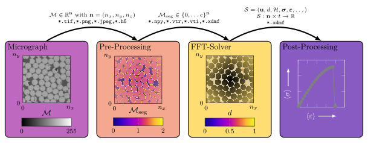
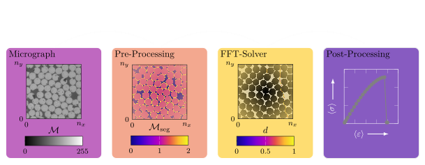

# FFTjax

FFTjax is a library for computing the Fast Fourier Transform (FFT) in JAX. It provides efficient implementations of the FFT and its inverse, as well as support for multi-dimensional FFTs and various normalization options.

  
  

