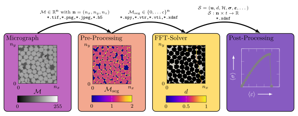
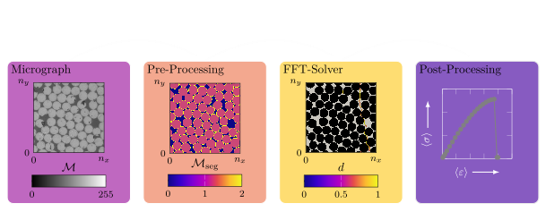

# FFTjax

FFTjax is a library for computing the Fast Fourier Transform (FFT) in JAX. It provides efficient implementations of the FFT and its inverse, as well as support for multi-dimensional FFTs and various normalization options.

  
  

-   🚀 __Getting Started__

    ---

    Install FFTjax and run your first FFT-based homogenization.

    [:octicons-arrow-right-24: Installation](installation.md)

-   📖 __Theorie__

    ---

    Background on variational FFT homogenization and the underlying theory.

    [:octicons-arrow-right-24: Theorie](theorie.md)

-   🧪 __Examples__

    ---

    Worked examples demonstrating FFTjax in practice.

    [:octicons-arrow-right-24: Examples](examples.md)

-   ⚡ __Benchmark__

    ---

    Check FFTjax's performance on your hardware, CPU or GPU.

    [:octicons-arrow-right-24: Benchmark](benchmark.md)

