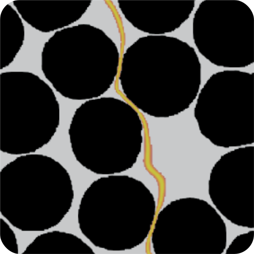

# FFTjax

  

&nbsp;

&nbsp;
&nbsp;

  <b>
    ⚡ GPU-accelerated &nbsp; &nbsp;
    🔁 Fully differentiable &nbsp; &nbsp;
    📐 Spectral methods &nbsp; &nbsp;
    🧠 ML-ready &nbsp; &nbsp;
    🧩 Voxel-based simulations &nbsp; &nbsp;
    🔍 Inverse material identification
  </b>

## What is FFTjax?

FFTjax is a next-generation FFT-based spectral solver framework inspired by classical FFT homogenization approaches such as FFTMAD — reimagined in JAX for differentiable, GPU-accelerated scientific computing.

At its core, FFTjax implements variational FFT solvers for periodic unit cells, enabling efficient solutions of mechanical, thermal, and multi-physics boundary value problems using spectral methods.

Built for modern computational mechanics, FFTjax bridges:

- 🏗 Variational FFT homogenization
- ⚙️ JIT-compiled, hardware-accelerated execution
- 🔁 End-to-end automatic differentiation
- 🎯 Inverse material calibration
- 📊 Bayesian optimization & uncertainty quantification

## News

- First doc implementation

## Getting Started

