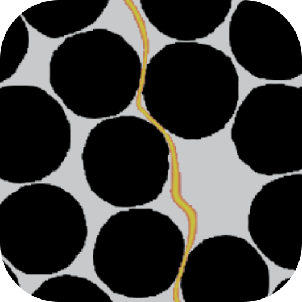

# FFTjax

<p align="center">
  
</p>


<div align="center">

[](https://github.com/choROPeNt/FFTjax)&nbsp;
[](https://choROPeNt.github.io/FFTjax/)
[]()&nbsp;
[]()&nbsp;

</div>

<p align="center">
  <b>
    ⚡ GPU-accelerated &nbsp; &nbsp;
    🔁 Fully differentiable &nbsp; &nbsp;
    📐 Spectral methods &nbsp; &nbsp;
    🧠 ML-ready &nbsp; &nbsp;
    🧩 Voxel-based simulations &nbsp; &nbsp;
    🔍 Inverse material identification
  </b>
</p>


## What is FFTjax?

FFTjax is a next-generation FFT-based spectral solver framework inspired by classical FFT homogenization approaches such as FFTMAD — reimagined in JAX for differentiable, GPU-accelerated scientific computing.

At its core, FFTjax implements variational FFT solvers for periodic unit cells, enabling efficient solutions of mechanical, thermal, and multi-physics boundary value problems using spectral methods.

Built for modern computational mechanics, FFTjax bridges:

- 🏗 Variational FFT homogenization
- ⚙️ JIT-compiled, hardware-accelerated execution
- 🔁 End-to-end automatic differentiation
- 🎯 Inverse material calibration
- 📊 Bayesian optimization & uncertainty quantification

## News

- First doc implementation

## Getting Started

FFTjax isn't on PyPI yet — install it from source in editable mode:

```bash
git clone https://github.com/choROPeNt/FFTjax.git
cd FFTjax
pip install -e .
```

GPU (CUDA), TPU, and AMD (ROCm) install variants, plus a smoke test to verify the install, are in
the [Getting Started guide](https://choROPeNt.github.io/FFTjax/documentation/installation).

A minimal example — solving mechanical equilibrium on a two-phase composite RVE under a prescribed
macroscopic strain:

```python
import jax.numpy as jnp
from generation.rve import make_square_composite_rve
from materialmodels.elastic.isotropic import LinearElasticIsotropic
from problems.mechanics import solve_mechanics

# Square-packed glass-fiber/epoxy RVE
phase_np, n, L, phi_act = make_square_composite_rve(phi=0.5, r_fiber=0.005, dx=0.0002, N_min=32, nz=1)
phase = jnp.array(phase_np.reshape(-1))
materials = [
    LinearElasticIsotropic(E=3.0e3, nu=0.35, name="epoxy matrix"),
    LinearElasticIsotropic(E=70.0e3, nu=0.20, name="glass fiber"),
]

# Prescribed macroscopic shear strain
eps_bar = jnp.array([[0.0, 1.0e-3, 0.0], [1.0e-3, 0.0, 0.0], [0.0, 0.0, 0.0]])

results = solve_mechanics(n, L, phase, materials, eps_bar)
sol = results[0].solution
print("converged:", bool(sol.converged))
print("tau_xy (avg):", float(jnp.mean(sol.sigma[0, 1])))
```

More worked examples (mixed boundary conditions, `jax.vmap` batching, J2 plasticity, gradient-based
inverse calibration) live in the [Example Gallery](https://choROPeNt.github.io/FFTjax/documentation/examples)
and as runnable notebooks under [`notebooks/`](notebooks/), each with an "Open in Colab" link.
